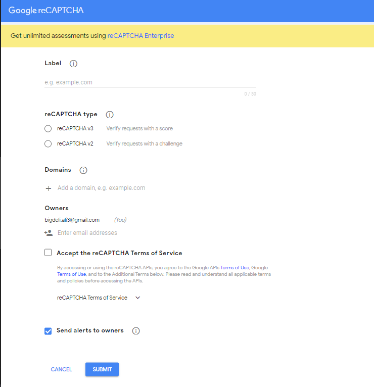
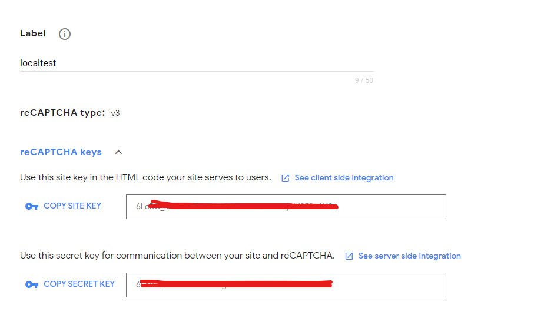
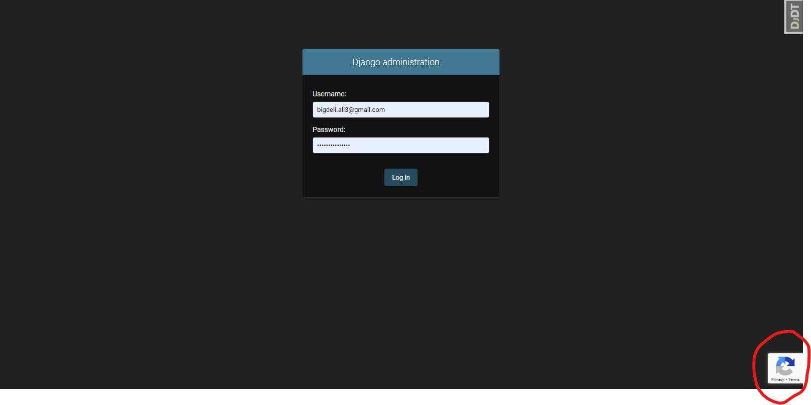
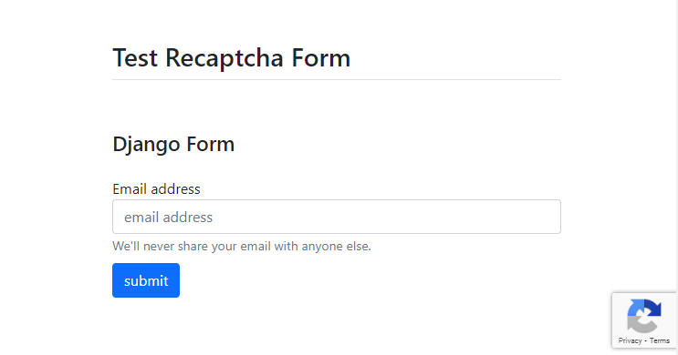
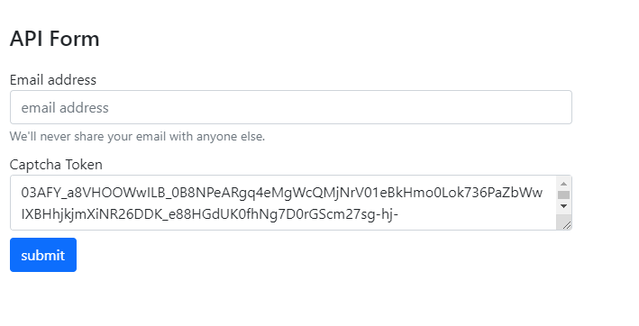

<div align="center">

<h1 align="center">Django All In One Recaptcha App</h1>
<h3 align="center">Sample Project to add recaptcha to forms,admin,serializer</h3>
</div>
<p align="center">
<a href="https://www.python.org" target="_blank">  </a>
<a href="https://www.djangoproject.com/" target="_blank">  </a> 
<a href="https://www.docker.com/" target="_blank">  </a>
<a href="https://www.postgresql.org" target="_blank">  </a>
<a href="https://git-scm.com/" target="_blank">  </a>
</p>

# Guideline
- [Guideline](#guideline)
- [Goal](#goal)
- [Demo](#demo)
- [Development usage](#development-usage)
  - [Clone the repo](#clone-the-repo)
  - [Enviroment Varibales](#enviroment-varibales)
  - [Build everything](#build-everything)
  - [Note](#note)
  - [Check it out in a browser](#check-it-out-in-a-browser)
- [Setup Recaptcha](#setup-recaptcha)
  - [1- Create Recaptcha](#1--create-recaptcha)
  - [2 - Add to INSTALLED\_APPS](#2---add-to-installed_apps)
  - [3 - Setup Keys](#3---setup-keys)
  - [4 - Setup domain (Optional)](#4---setup-domain-optional)
  - [5 - Setup proxy (Optional)](#5---setup-proxy-optional)
  - [6 - Change Timeout (Optional)](#6---change-timeout-optional)
  - [7 - Change Minimum Score (Optional)](#7---change-minimum-score-optional)
- [Usage](#usage)
  - [Add to Admin Login](#add-to-admin-login)
  - [Add to Django Forms](#add-to-django-forms)
  - [Add to Django RestFramework](#add-to-django-restframework)
- [Dev Mode and Failing Mode](#dev-mode-and-failing-mode)
- [License](#license)
- [Bugs](#bugs)

# Goal
This project main goal is to provide a sample to show you how to implement multiple file uploading with django form and api.

# Demo


# Development usage
You'll need to have [Docker installed](https://docs.docker.com/get-docker/).
It's available on Windows, macOS and most distros of Linux. 

If you're using Windows, it will be expected that you're following along inside
of [WSL or WSL
2](https://nickjanetakis.com/blog/a-linux-dev-environment-on-windows-with-wsl-2-docker-desktop-and-more).

That's because we're going to be running shell commands. You can always modify
these commands for PowerShell if you want.


## Clone the repo
Clone this repo anywhere you want and move into the directory:
```bash
git clone https://github.com/AliBigdeli/Django-All-In-One-Recaptcha-App.git
```

## Enviroment Varibales
enviroment varibales are included in docker-compose.yml file for debugging mode and you are free to change commands inside:

```yaml
services:
  backend:
  command: sh -c "python manage.py check_database && \ 
                      yes | python manage.py makemigrations  && \
                      yes | python manage.py migrate  && \                    
                      python manage.py runserver 0.0.0.0:8000"
    environment:      
      - DEBUG=True
```


## Build everything

The first time you run this it's going to take 5-10 minutes depending on your
internet connection speed and computer's hardware specs. That's because it's
going to download a few Docker images such as minio and build the Python + requirements dependencies. and dont forget to create a .env file inside dev folder for django and postgres with the samples.

```bash
docker compose up --build
```

Now that everything is built and running we can treat it like any other Django
app.

## Note

If you receive an error about a port being in use? Chances are it's because
something on your machine is already running on port 8000. then you have to change the docker-compose.yml file according to your needs.

Django reCAPTCHA uses a modified version of the <a href="https://pypi.org/project/recaptcha-client/">Python reCAPTCHA client</a> which is included in the package as client.py.


## Check it out in a browser
Visit <http://localhost:8000> in your favorite browser.


# Setup Recaptcha

## 1- Create Recaptcha 

first of all you need to have a recaptchav3 ```site_key``` and ```secret_key``` in order to work with the recaptcha.
so first of all open the provided url:

- RecaptchaConsole <https://www.google.com/recaptcha/admin>

after opening the url head to the creation page, and create a version 3 recaptcha (At the Moment this module only supports recaptchav3)
<div align="center">

</div>


and also include ```localhost``` and ```127.0.0.1``` inside the domains list for testing locally. when your done you will end up having **SITE KEY** and **SECRET KEY**.

<div align="center">

</div>

## 2 - Add to INSTALLED_APPS
in order to use recaptcha inside the project firstly you need to add the app inside INSTALLED_APPS list:

```python
INSTALLED_APPS = [
    ...,
    'aio_recaptcha',
    ...
]
```
**Note:** in case if you wanted to use the app as a module inside your own project all you have to do is just copy the whole app directory to your project.

## 3 - Setup Keys

Add the Google reCAPTCHA keys generated in step 1 to your Django settings

```python
RECAPTCHAV3_SITE_KEY  = "xxxxxxxxxxxxxxxxxxxxxxxxxxxxxxxxxxxxxxxxxxx"
RECAPTCHAV3_SECRET_KEY = "xxxxxxxxxxxxxxxxxxxxxxxxxxxxxxxxxxxxxxxxxxx"
```

## 4 - Setup domain (Optional)
you can change the recaptcha default domain to anything you desire, or use the www.google.com as default.
```python
RECAPTCHA_DOMAIN = 'www.recaptcha.net'
```

## 5 - Setup proxy (Optional)
also you can add custom proxies to the validator client by setting the recaptcha_proxy or dont include it to set it as None. by default its set to None.
```python
RECAPTCHA_PROXY = {'http': 'http://127.0.0.1:8000', 'https': 'https://127.0.0.1:8000'}
```

## 6 - Change Timeout (Optional)
you can set the client timeout check for validation by changing the value of the environment shown below. by default its set to 10.
```python
RECAPTCHA_VERIFY_REQUEST_TIMEOUT = 10
```

## 7 - Change Minimum Score (Optional)
also you can set the minimum score to pass the validation test in here as a global mechanism. by default its set to 0.5.
```python
RECAPTCHA_REQUIRED_SCORE = 0.5
```

# Usage
asd
## Add to Admin Login

it cannot be more simpler than this, all you have to do is to enable the environment in the settings and you will be able to see the recaptcha widget in the admin login page.by default its False.

```python
RECAPTCHA_ADMIN_ENABLE=True
```
you can see the outcome of this action in the picture.

<div align="center">

</div>

## Add to Django Forms
in order to add the recaptcha field to the forms i have made a sample for you. which is like this.
```python
from django import forms
from .models import NewsLetter
from aio_recaptcha.form.fields import ReCaptchaField
from aio_recaptcha.form.widgets import ReCaptchaV3


class NewsLetterForm(forms.ModelForm):
    captcha = ReCaptchaField(widget=ReCaptchaV3())
    class Meta:
        model = NewsLetter
        fields = ('email','captcha' )
```
all you have to do is to add an extra field to the form and show it include it inside the templates too.
```html
<form action="." method="POST" class="form-inline py-1">
    <div class="form-group py-1">
        
        {{form.captcha}}
        <label for="exampleInputEmail1">Email address</label>
        <input type="email" name="email" class="form-control" placeholder="email address">
        <small id="emailHelp" class="form-text text-muted">We'll never share your email with anyone
            else.</small>
    </div>

    <div class="form-group py-1">
        <button type="submit" class="btn btn-primary">submit</button>
    </div>
</form>
```
which you will end up having it inside the page:
<div align="center">

</div>

## Add to Django RestFramework
also you can add recaptcha or captcha as a field to serializer to check the incoming token which has been created inside the page. 
all you have to do is to add a custom field inside the serializer just like the demo i made:
```python
from rest_framework import serializers
from rest_framework.exceptions import ValidationError
from ..models import NewsLetter
from aio_recaptcha.api.serializers import ReCaptchaV3Field


class NewsLetterSerializer(serializers.ModelSerializer):
    captcha =  ReCaptchaV3Field(
        action="validate_captcha",  
    )
    class Meta:
        model = NewsLetter
        fields = ['email','captcha']
    
    
    def validate(self, attrs):
        attrs.pop("captcha",None) # important to remove
        return super().validate(attrs)

```
**Note:** dont forget to remove the captcha field inside the validator or you will end up with and exception for extra fields to write in the model.

and you have to validate the serializer by saying is_valid in the view.
```python
from rest_framework.response import Response
from rest_framework import status, viewsets

from .serializers import *
from ..models import *


class NewsLetterModelViewSet(viewsets.ModelViewSet):
    
    serializer_class = NewsLetterSerializer

    def create(self, request, *args, **kwargs):
        serializer = self.get_serializer(data=request.data)
        serializer.is_valid(raise_exception=True) # important to have
        serializer.save()
        return Response({"details":"successfully signed up to newsletter"}, status=status.HTTP_201_CREATED)
```
and lastly inside the template you should generate a token for each request you want to make and send the token with other parameters of the body.
the following code will generate the token based on the site_key.
```html


...

<form id="api-form">
    <div class="form-group py-1">
        <label for="exampleInputEmail1">Email address</label>
        <input class="form-control" name="email" type="email" placeholder="email address">
        <small id="emailHelp" class="form-text text-muted">We'll never share your email with anyone
            else.</small>
    </div>
    <div class="form-group py-1">
        <label for="exampleInputEmail1">Captcha Token</label>
        <textarea class="form-control" name="captcha" type="text" id="captcha"></textarea>
    </div>
    <div class="form-group py-1">
        <button type="submit" class="btn btn-primary">submit</button>
    </div>
</form>
...

<script src="https://www.google.com/recaptcha/api.js?render="></script>
<script>
    function renew_captcha() {
        grecaptcha.ready(function () {
            // do request for recaptcha token
            // response is promise with passed token
            grecaptcha.execute('', { action: 'validate_captcha' })
                .then(function (token) {
                    // add token value to form
                    $('#captcha').val(token)
                    // console.log(token)
                });
        });
    }
    renew_captcha()
</script>

<script>
    $("#api-form").submit(function (event) {
        event.preventDefault();
        var formData = new FormData($(this)[0]);
        // AJAX request
        $.ajax({
            url: '/api/newsletter',
            type: 'post',
            data: formData,
            dataType: 'application/json',
            contentType: false,
            processData: false,
            complete: function (xhr, textStatus) {
                if (xhr.status != 201) {
                    toastr["error"](xhr.responseText)
                }
                else {
                    toastr["success"](xhr.responseText)
                }
                document.getElementById("api-form").reset();
                renew_captcha()
            }
        });

    });

</script>

```
at last you will end up with a form inside the template which will refresh the captcha token based on each request. you can see the outcome of the whole setup here:
<div align="center">

</div>

# Dev Mode and Failing Mode
in order to test the whole thing locally and bypassing the validations i have provided an environment to by pass all validations and as result it will successfully respond to any validations.
```python
RECAPTCHA_DEV_MODE = True
```

also if you wanted to test your service in failing mode, like each request should be failed for validating the captcha, you can use the environment i have provided to set all the responses end up with failure.
```python
RECAPTCHA_ALWAYS_FAIL = True
```

**Note:** if you want to test it as always failure mode you have to put the dev mode on True mode or else it will not work. this is for making sure your not making any mistakes in production.

# License
MIT.


# Bugs
Feel free to let me know if something needs to be fixed. or even any features seems to be needed in this repo.
